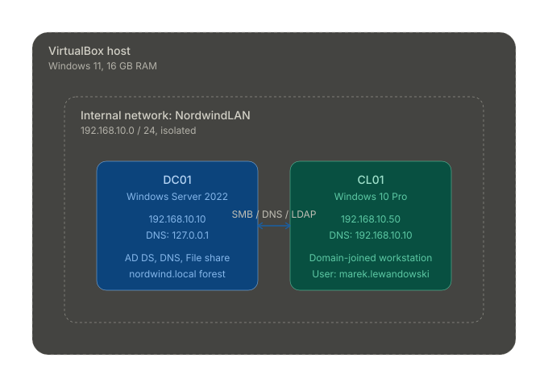
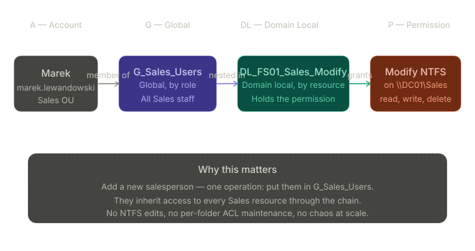

# Active Directory Lab — Nordwind Logistics

> An end-to-end Active Directory environment built from scratch in Windows Server 2022, designed and deployed for a fictional 40-person logistics company. The lab covers everything a junior systems administrator is expected to know on day one: domain controller promotion, OU planning, user and group management following the AGDLP model, file share security with SMB and NTFS, Group Policy deployment, and a domain-joined Windows 10 workstation.

\---

## Why this project exists

This is not a "follow a YouTube tutorial" lab. Every architectural decision here was made consciously, documented in a design document **before** any clicking, and justified against production best practice. The goal was to demonstrate not only *that I can install Active Directory*, but that I understand **why** it is configured the way it is - and what I would do differently in a real production environment.

\---

## Architecture

### Network topology



Two virtual machines connected through a VirtualBox internal network (`NordwindLAN`), fully isolated from the host and the public internet. `DC01` runs Active Directory Domain Services, DNS, and a file share. `CL01` is a Windows 10 Pro workstation joined to the `nordwind.local` domain.

### AGDLP permission chain



Every permission in this lab follows the **AGDLP** model: **A**ccounts go into **G**lobal groups by role, global groups nest into **D**omain **L**ocal groups by resource, and only domain local groups receive **P**ermissions. No user is ever granted direct access to a folder. Adding or removing a salesperson is a single group-membership change.

\---

## Tech stack

|Component|Choice|
|-|-|
|Hypervisor|VirtualBox 7 (Internal Network mode)|
|Domain controller|Windows Server 2022 Standard (Desktop Experience)|
|Domain client|Windows 10 Pro|
|Forest functional level|Windows Server 2016|
|Automation|PowerShell 5.1 (5 idempotent scripts)|
|Documentation|Markdown + SVG diagrams|

\---

## The fictional company

**Nordwind Logistics Sp. z o.o.** - a freight forwarding company headquartered in Poznań with a warehouse near Wrocław. Around 40 employees across seven departments (Management, IT, Accounting, Sales, Logistics, Warehouse, HR). The lab models a realistic small-to-medium business - large enough to need proper structure, small enough to fit in two VMs.

The full company profile and design rationale live in [`docs/01-design.md`](docs/01-design.md).

\---

## What was built

### Domain and DNS

* New forest `nordwind.local`, NetBIOS name `NORDWIND`
* Single domain controller `DC01` (192.168.10.10) with AD DS, DNS, and Global Catalog
* Static IP, hostname `DC01`, DNS pointing to itself (`127.0.0.1`)
* All four core services healthy: ADWS, NTDS, DNS, KDC

### Organizational unit structure

A custom top-level container (`OU=Nordwind`) with department OUs underneath. The default Windows `Users` and `Computers` containers are intentionally left empty - they are CN containers, not OUs, and cannot be Group-Policy-targeted.

```
nordwind.local
└── Nordwind
    ├── \_Admins              ← privileged accounts, sorted to top
    ├── Users
    │   ├── Management, IT, Accounting, Sales,
    │   │   Logistics, Warehouse, HR
    ├── Computers
    │   ├── Workstations, Servers
    ├── Groups
    │   ├── Security, Distribution
    └── ServiceAccounts
```

### Users and groups

* 10 user accounts created from a CSV (HR-style workflow), placed automatically in the correct department OU
* 7 global security groups (`G\_\*`) - one per department, named by **role**
* 7 domain local groups (`DL\_\*`) - named by **resource**, holding the actual permissions
* Cross-department `DL\_FS01\_Public\_Read` for company-wide read access

### File share with double-layer security

A real working share at `\\\\DC01\\Sales` with:

* **SMB share permissions:** Domain Admins (Full), `DL\_FS01\_Sales\_Modify` (Change)
* **NTFS permissions:** SYSTEM (FullControl), Administrators (FullControl), `DL\_FS01\_Sales\_Modify` (Modify)
* `BUILTIN\\Users` explicitly removed for zero-trust — only group members get access
* Effective permission for a Sales user: Modify (the more restrictive of SMB and NTFS wins)

### Group Policy

* `GPO-Nordwind-Password-Policy` - minimum 12 characters, complexity required, lockout after 5 failed attempts for 15 minutes
* Linked to the domain root (a custom GPO, **not** an edit of the Default Domain Policy)
* Verified on `CL01` with `gpresult /r /scope:computer`

### Domain client

* `CL01` joined to `nordwind.local` with `Add-Computer`
* `marek.lewandowski` (Sales) successfully logs on as a domain user
* Marek can read and write files in `\\\\DC01\\Sales`
* `magdalena.kaminska` (HR) is **denied** access to the same share - proving access is gated by AGDLP membership, not just domain authentication

\---

## Automation

All repeatable operations are scripted in PowerShell. Each script is **idempotent** - safe to run multiple times - and uses the AD module's standard cmdlets.

|Script|Purpose|
|-|-|
|[`01-create-ou-structure.ps1`](scripts/01-create-ou-structure.ps1)|Build the entire OU tree from the design document|
|[`02-create-users.ps1`](scripts/02-create-users.ps1)|Bulk-import users from `data/employees.csv`, generate random initial passwords, force change at first logon|
|[`03-create-groups-agdlp.ps1`](scripts/03-create-groups-agdlp.ps1)|Create 7 global and 7 domain local security groups|
|[`04-add-users-to-groups.ps1`](scripts/04-add-users-to-groups.ps1)|Wire up the AGDLP chain (users → global → domain local)|
|[`05-cl01-prepare-and-join.ps1`](scripts/05-cl01-prepare-and-join.ps1)|One-shot prepare-and-join for a new client: static IP, DNS, hostname, domain join|

\---

## Walkthrough (selected screenshots)

The `screenshots/` folder contains 41 chronological screenshots covering the full build. Highlights:

|#|What it shows|
|-|-|
|`02–07`|VM creation, network configuration, Server 2022 install, first login|
|`08–11`|Static IP, hostname change to `DC01`, ipconfig verification|
|`12–18`|AD DS role install, forest promotion, healthy services|
|`19–21`|OU structure built via GUI + PowerShell, idempotent script output|
|`22–24`|Users and groups created from CSV; AGDLP membership verified with `Get-ADPrincipalGroupMembership`|
|`25–29`|ADUC tree showing departments, group properties confirming nested membership|
|`30–35`|CL01 created, joined to `nordwind.local`, login as `marek.lewandowski`|
|`36–39`|GPO created, linked, applied, verified with `gpresult`|
|`40`|SMB and NTFS permissions side-by-side on `\\\\DC01\\Sales`|
|`41`|Marek (Sales) successfully accesses the share|
|`42`|Magdalena (HR) denied — AGDLP enforced|

\---

## What I learned (real lab incidents)

These are problems that actually happened during the build. They are documented because **the troubleshooting is the learning**, and because real-world systems administration looks much more like this than like the happy path.

### 1\. Lost local Administrator password on first install

Selecting Polish (214) keyboard layout during Windows installation caused a layout mismatch at first login — the password I had typed during setup could no longer be retyped. Reinstalled with English (US) keyboard; configured Polish layout post-install via Settings.  
**Lesson:** always use English (US) keyboard during Windows installation; configure regional layouts afterwards.

### 2\. PowerShell parse errors from "smart quotes"

A script copy-pasted through Notepad on Polish Windows had its straight apostrophes converted to typographic curly ones (`'` → `'`), which the PowerShell parser rejects with cryptic "missing terminator" errors. Recreated the script directly in PowerShell ISE.  
**Lesson:** edit `.ps1` files in PowerShell ISE or VS Code — never use Notepad as a copy buffer between systems with different localization.

### 3\. `Test-Connection -Quiet` fails in VirtualBox Internal Network

Despite `ping` and `Test-NetConnection -Port 53` confirming Layer 3/4 connectivity, the scripted `Test-Connection -Quiet` returned `Generic failure`. Worked around it by skipping the precheck and running `Add-Computer` directly — domain join succeeded on first attempt.  
**Lesson:** scripted automation is great for repetitive tasks, but every admin must know the underlying single-line commands when scripts misfire.

### 4\. Password reset rejected by complexity rules

`Marek2026` was rejected as a new password for `marek.lewandowski` because it contained a fragment of the user's name. AD complexity is not just "3 of 4 character classes" — it also forbids username and display-name fragments. Used `Wiosna2026!` instead.  
**Lesson:** AD password complexity has hidden rules; always test on the lab account before scripting bulk resets.

### 5\. `gpresult` returned "does not have RSOP data"

Running `gpresult /r` as Administrator while inspecting a policy that targets `Computer Configuration` returned no data — because the user being inspected (`Administrator`) had never logged on, and the default scope is User. Switched to `gpresult /r /scope:computer` (elevated) and the policy appeared.  
**Lesson:** match the policy scope (`/scope:computer` vs `/scope:user`) to where the GPO settings actually live.

\---

## What's intentionally out of scope

These were left out on purpose to keep the lab focused. Each one is a meaningful next step:

* Multi-site replication (a second DC in the Wrocław warehouse)
* Read-Only Domain Controller (RODC) for the branch
* Public Key Infrastructure (AD CS) for internal certificates
* Hybrid identity with Microsoft Entra ID (Azure AD Connect)
* DHCP Server role (clients use static IPs in the lab)
* A dedicated file server (the share is on DC01 for simplicity — production would use FS01)
* System State backup of DC01 and disaster-recovery runbook

Listing what was **consciously skipped** is part of the design — it shows awareness of the bigger picture.

\---

## Repository layout

```
Portfolio-AD/
├── README.md                    ← you are here
├── docs/
│   ├── 01-design.md             ← full design document (network plan, OU plan, naming conventions)
│   └── 02-ad-notes.md           ← personal study notes + interview cheat sheet
├── data/
│   └── employees.csv            ← simulated HR data, input for user-creation script
├── scripts/
│   ├── 01-create-ou-structure.ps1
│   ├── 02-create-users.ps1
│   ├── 03-create-groups-agdlp.ps1
│   ├── 04-add-users-to-groups.ps1
│   └── 05-cl01-prepare-and-join.ps1
├── diagrams/
│   ├── 01-network-topology.svg
│   └── 02-agdlp-flow.svg
└── screenshots/
    └── 02\_\*.png … 42\_\*.png      ← 41 chronological screenshots
```

\---

## How to reproduce this lab

1. Read [`docs/01-design.md`](docs/01-design.md) end to end.
2. Install VirtualBox 7.
3. Build `DC01` (Windows Server 2022, 4 GB RAM, 2 vCPU, 60 GB disk, Internal Network = `NordwindLAN`).
4. Configure static IP `192.168.10.10`, DNS `127.0.0.1`, hostname `DC01`.
5. Install AD DS role and promote to a new forest `nordwind.local`.
6. Run `scripts/01-create-ou-structure.ps1` on DC01.
7. Copy `data/employees.csv` to `C:\\LabFiles\\employees.csv` and run `02-create-users.ps1`.
8. Run `03-create-groups-agdlp.ps1` and then `04-add-users-to-groups.ps1`.
9. Build `CL01` (Windows 10 Pro, 2 GB RAM, 2 vCPU, 40 GB disk, same Internal Network).
10. Run `scripts/05-cl01-prepare-and-join.ps1` on CL01 (or the manual `Add-Computer` workaround if `Test-Connection` misbehaves).
11. Reset a domain user's password (e.g., `Set-ADAccountPassword -Identity marek.lewandowski -Reset ...`) and log on as that user on CL01.

\---

## License

This lab is provided as-is for educational and portfolio purposes. The PowerShell scripts can be adapted freely for personal labs.

\---

## About

Built by **Maciej Stawowy** as part of preparation for a Junior SysAdmin / IT Support role.

Connect: [LinkedIn](https://www.linkedin.com/in/maciej-stawowy-3ab999153) — [Email](mailto:mac.stawowy@gmail.com)

*Last updated: May 2026.*

